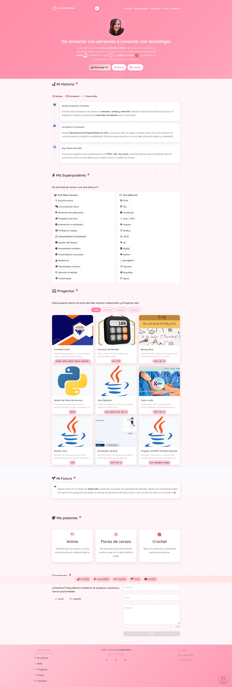
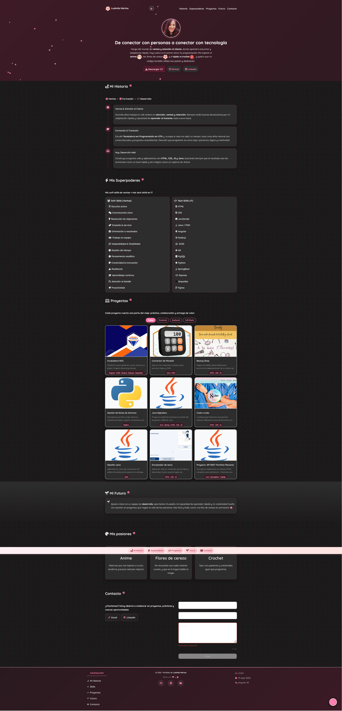

# 🌸 Portfolio Personal - Ludmila Martos

<div align="center">
  
  
  **Desarrolladora Full Stack | Angular | Java | Python**
  
  [](https://angular.io/)
  [](https://www.typescriptlang.org/)
  [](https://web.dev/progressive-web-apps/)
  [](https://web.dev/vitals/)
  [](LICENSE)
  [](https://github.com/Ludmimar/portfolio-angular)
</div>

---

## 📋 Descripción del Proyecto

Portfolio personal desarrollado con **Angular 20.3.0** que muestra mi experiencia como desarrolladora Full Stack. El proyecto incluye una presentación interactiva de mis proyectos, habilidades técnicas, experiencia profesional y un sistema de contacto integrado con EmailJS.

### ✨ Características Principales

- 🎨 **Diseño Responsive** con tema claro/oscuro
- ⚡ **Performance Optimizada** con Core Web Vitals
- 📱 **PWA Ready** con Service Worker
- 🚀 **Lazy Loading** de componentes e imágenes
- 📧 **Sistema de Contacto** integrado con EmailJS
- 🎭 **Animaciones Suaves** y transiciones
- ♿ **Accesibilidad** optimizada
- 🧪 **Testing** con Jest y Karma

## 🌐 Demo en Vivo

**🔗 [Ver Portfolio en Vivo](https://martos-ludmila-portfolio-angular.vercel.app/)**

> **Nota**: Reemplaza la URL con tu dominio real cuando esté desplegado.

## 📸 Capturas de Pantalla.


| 🖥️ Desktop | 📱 Mobile | 🌙 Modo Oscuro |
|------------|-----------|----------------|
|  |  |  |


## 🛠️ Tecnologías Utilizadas

### Frontend
- **Angular 20.3.0** - Framework principal
- **TypeScript 5.9.2** - Lenguaje de programación
- **SCSS** - Estilos y diseño
- **RxJS 7.8.0** - Programación reactiva
- **EmailJS 3.2.0** - Servicio de email

### Herramientas de Desarrollo
- **Angular CLI 20.2.1** - Herramientas de desarrollo
- **Jest 30.1.3** - Framework de testing
- **Karma 6.4.0** - Test runner
- **Docker** - Containerización
- **Nginx** - Servidor web
- **Express 5.1.0** - Servidor SSR

### Servicios Externos
- **EmailJS** - Envío de emails (configurado con service ID: service_71n6aof)
- **Service Worker** - Funcionalidades PWA con estrategias de cache optimizadas

## 🚀 Instalación y Configuración

### Pre-requisitos
- Node.js 18+ 
- npm 9+
- Angular CLI 20.2.1+

### Instalación

1. **Clonar el repositorio**
```bash
git clone https://github.com/Ludmimar/portfolio-angular.git
cd portfolio-angular
```

2. **Instalar dependencias**
```bash
npm install
```

3. **Configurar variables de entorno (Opcional)**
```bash
# El proyecto ya incluye configuración básica en environment.ts
# Para personalizar EmailJS, edita el archivo:
nano src/environments/environment.ts
```

4. **Ejecutar en desarrollo**
```bash
ng serve
```

5. **Abrir en el navegador**
```
http://localhost:4200
```

## 📁 Estructura del Proyecto

```
src/
├── app/
│   ├── components/          # Componentes de la aplicación
│   │   ├── contact/         # Formulario de contacto
│   │   ├── footer/          # Pie de página
│   │   ├── future/          # Sección de planes futuros
│   │   ├── header/          # Encabezado y navegación
│   │   ├── hero/            # Sección principal
│   │   ├── navigation/      # Navegación sticky
│   │   ├── passions/       # Pasiones e intereses
│   │   ├── petal-animation/ # Animación de pétalos
│   │   ├── projects/        # Galería de proyectos
│   │   ├── skills/          # Habilidades técnicas
│   │   ├── timeline/        # Experiencia profesional
│   │   └── ...              # Componentes adicionales
│   ├── services/            # Servicios de la aplicación
│   │   ├── email.ts         # Servicio de email con EmailJS
│   │   ├── project.ts       # Gestión de proyectos
│   │   ├── theme.ts         # Gestión de temas claro/oscuro
│   │   ├── scroll.ts        # Animaciones de scroll
│   │   ├── performance-monitor.ts # Monitoreo de Core Web Vitals
│   │   ├── analytics.ts     # Servicio de analytics
│   │   ├── error-handler.ts # Manejo de errores
│   │   ├── image-optimization.ts # Optimización de imágenes
│   │   └── translation.ts   # Servicio de traducción
│   ├── pipes/               # Pipes personalizados
│   └── assets/              # Recursos estáticos
│       ├── img/             # Imágenes
│       ├── data/            # Datos JSON
│       └── files/           # Archivos descargables
├── environments/            # Configuraciones de entorno
└── styles.scss              # Estilos globales
```

## 🎯 Funcionalidades

### 🏠 Página Principal
- **Hero Section** con presentación personal
- **Navegación Sticky** con scroll suave
- **Animaciones de Pétalos** decorativas con CSS
- **Botón Scroll to Top** automático con Intersection Observer
- **Sección de Pasiones** con intereses personales
- **Sección Future** con planes profesionales

### 👩‍💻 Sección Profesional
- **Timeline** de experiencia laboral
- **Skills** organizadas por categorías
- **Proyectos** con filtros y modales
- **Tecnologías** utilizadas

### 📧 Sistema de Contacto
- **Formulario Reactivo** con validaciones Angular
- **Integración EmailJS** para envío automático (service_71n6aof)
- **Estados de Loading** y feedback visual
- **Manejo de Errores** robusto con mensajes específicos
- **Validación de Email** con regex

### 🎨 Personalización
- **Tema Claro/Oscuro** automático
- **Detección de Preferencias** del sistema
- **Transiciones Suaves** entre temas
- **Persistencia** de preferencias

## 🧪 Testing

### Ejecutar Tests
```bash
# Tests unitarios con Jest
npm run test:jest

# Tests con Karma
npm run test

# Tests con cobertura
npm run test:coverage

# Tests E2E
npm run e2e

# Tests con CI
npm run test:ci
```

### Cobertura de Tests
- **Servicios**: 80%+ (configurado en jest.config.js)
- **Componentes**: 80%+
- **Pipes**: 80%+
- **Cobertura Total**: 80%+ (threshold global configurado)

## 🚀 Deployment

### Build de Producción
```bash
# Build optimizado
npm run build:prod

# Análisis de bundle
npm run analyze
```

### Docker
```bash
# Construir imagen
npm run docker:build

# Ejecutar contenedor
npm run docker:run

# Desarrollo con Docker Compose
npm run docker:dev
```

### Variables de Entorno para Producción
```typescript
// environment.prod.ts
export const environment = {
  production: true,
  apiUrl: 'https://tu-dominio.com',
  analytics: {
    enabled: true,
    trackingId: 'GA_TRACKING_ID'
  },
  performance: {
    monitoring: true,
    logMetrics: false
  }
};
```


## 📊 Performance

### Métricas Objetivo
- **Lighthouse Score**: 95+/100
- **First Contentful Paint**: < 1.8s
- **Largest Contentful Paint**: < 2.5s
- **Cumulative Layout Shift**: < 0.1
- **Bundle Size**: < 200KB

### Optimizaciones Implementadas
- ✅ **OnPush Change Detection** en componentes principales
- ✅ **Service Worker** con estrategias de cache optimizadas
- ✅ **Performance Monitor** con Core Web Vitals
- ✅ **Intersection Observer** para animaciones de scroll
- ✅ **Bundle Splitting** automático con Angular CLI
- ✅ **Tree Shaking** optimizado
- ✅ **Image Optimization** con lazy loading

## 🔧 Scripts Disponibles

```bash
# Desarrollo
npm start                    # Servidor de desarrollo
npm run serve               # Servidor de desarrollo (alias)

# Build
npm run build               # Build de desarrollo
npm run build:prod         # Build de producción
npm run watch              # Build con watch mode

# Testing
npm run test               # Tests con Karma
npm run test:jest         # Tests con Jest
npm run test:coverage     # Tests con cobertura
npm run test:all          # Todos los tests

# Performance
npm run analyze            # Análisis de bundle
npm run audit:performance  # Auditoría de performance
npm run audit:lighthouse  # Auditoría con Lighthouse
npm run audit:bundle     # Análisis de bundle con webpack

# Docker
npm run docker:build      # Construir imagen Docker
npm run docker:run        # Ejecutar contenedor
npm run docker:dev        # Desarrollo con Docker Compose

# Utilidades
npm run lint              # Linting
npm run lint:fix         # Linting con auto-fix
npm run precommit        # Pre-commit hooks
npm run prepush          # Pre-push hooks
```

## 📱 PWA Features

### Service Worker
- **Cache First** para assets estáticos e imágenes
- **Stale While Revalidate** para HTML
- **Network First** para APIs
- **Offline Support** básico
- **Cache Versioning** (v2) para actualizaciones

### Manifest
- **App Icons** en múltiples tamaños (192x192, 512x512)
- **Theme Colors** dinámicos (#ff7bac)
- **Display Mode** standalone
- **Start URL** configurada (/)
- **Background Color** (#fff6f9)

## 🎨 Personalización

### Temas
El proyecto soporta temas personalizados mediante CSS custom properties:

```scss
:root {
  --primary: #ff7bac;
  --accent: #ffc7d2;
  --text: #4d3a3a;
  --bg: #fff6f9;
  --card: #ffffff;
}

[data-theme="dark"] {
  --primary: #ff7bac;
  --accent: #ffc7d2;
  --text: #e8e8e8;
  --bg: #1a1a1a;
  --card: #2d2d2d;
}
```

### Animaciones
Las animaciones están optimizadas para performance:
- **GPU Acceleration** habilitada
- **Reduced Motion** soportado
- **Intersection Observer** para lazy loading

## 🗺️ Roadmap

### Próximas características
- [ ] 🌍 Soporte multi-idioma (i18n)
- [ ] 📊 Dashboard de analytics
- [ ] 🎨 Más temas personalizados
- [ ] 📝 Blog integrado
- [ ] 🎯 Sección de testimonios
- [ ] 🔍 Búsqueda de proyectos
- [ ] 📈 Métricas de performance en tiempo real

### Mejoras técnicas
- [ ] ⚡ Migración a Angular Signals
- [ ] 🧪 Aumentar cobertura de tests al 90%
- [ ] 📦 Optimización adicional del bundle
- [ ] 🔒 Implementar CSP headers
- [ ] 🌐 Configurar CDN

## 🐛 Troubleshooting

### Problemas comunes

#### Error al instalar dependencias
```bash
# Limpiar cache de npm
npm cache clean --force
rm -rf node_modules package-lock.json
npm install
```

#### Error de build
```bash
# Verificar versión de Node.js (requiere 18+)
node --version

# Limpiar build anterior
rm -rf dist/
ng build --configuration=production
```

#### Service Worker no funciona
```bash
# Verificar que el proyecto esté servido por HTTPS
# En desarrollo, usar: ng serve --ssl
```

### Obtener ayuda
Si encuentras algún problema, por favor:
1. Revisa la sección de [Troubleshooting](#-troubleshooting)
2. Busca en [Issues existentes](https://github.com/Ludmimar/portfolio-angular/issues)
3. Crea un [nuevo issue](https://github.com/Ludmimar/portfolio-angular/issues/new) con detalles del problema


## 🙏 Reconocimientos

- [Angular](https://angular.io/) - Framework principal
- [Font Awesome](https://fontawesome.com/) - Iconos
- [EmailJS](https://www.emailjs.com/) - Servicio de email
- [Google Fonts](https://fonts.google.com/) - Tipografías
- [Unsplash](https://unsplash.com/) - Imágenes de referencia
- Inspiración de diseño de [Dribbble](https://dribbble.com/) y [Behance](https://behance.net/)

## 📞 Contacto

**Ludmila Martos**
- 📧 Email: [ludmilamartos@gmail.com](mailto:ludmilamartos@gmail.com)
- 💼 LinkedIn: [Ludmila Martos](https://www.linkedin.com/in/ludmimar89/)
- 🐙 GitHub: [Ludmimar](https://github.com/Ludmimar)
- 🌐 Portfolio: [ludmilamartos.dev](https://martos-ludmila-portfolio-angular.vercel.app/)

---

<div align="center">
  <p>Hecho con ❤️ y Angular 20</p>
  <p>⭐ Si te gusta este proyecto, ¡dale una estrella!</p>
  <p>🚀 Desarrollado por Ludmila Martos</p>
</div>
